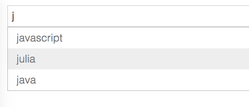

# react-search

react-search is a simple search box autocomplete component using react.js.



## Installation

`npm install react-search --save`

## Usage

```javascript
var React = require('react');
var Search = require('react-search');

var ITEMS = ['ruby', 'javascript', 'lua', 'go', 'c++', 'julia', 'java', 'c', 'scala','haskell']

React.renderComponent(<Search items={ITEMS} />, document.getElementById("container"));

```

## Callbacks onClick and onChange

You can specify callback functions for onClick of the element and onChange of the search input. The element passed in is the SyntheticKeyboardEvent, which you can use to get the target or value.

```javascript
var React = require('react');
var Search = require('react-search');

var MyForm = React.createClass({ displayName: "MyForm",

	/* the custom callback triggered by react-search */
    myFunc:function(e) {
      console.log(e.target.value);
    },

    render:function() {

        var ITEMS = ['ruby', 'javascript', 'lua', 'go', 'c++', 'julia', 'java', 'c', 'scala','haskell']

        return (
          <form>
            <Search items={ITEMS} onChange={this.myFunc} onClick={this.myFunc} />
          </form> 
        );
    }

});

React.renderComponent(<MyForm />, document.getElementById("container"));

```

## Styles

react-search can be used with your own custom styles. A minimal search.css style sheet is included as a guide.

## Development

Initial set up, run:
    
    npm install

For watch on files, live reload, JSX transpiling and browserify, run:

    gulp

## License

(The MIT License)

Copyright (c) 2015 isekivacenz &lt;stevenisekimartin@gmail.com&gt;

Permission is hereby granted, free of charge, to any person obtaining
a copy of this software and associated documentation files (the
'Software'), to deal in the Software without restriction, including
without limitation the rights to use, copy, modify, merge, publish,
distribute, sublicense, and/or sell copies of the Software, and to
permit persons to whom the Software is furnished to do so, subject to
the following conditions:

The above copyright notice and this permission notice shall be
included in all copies or substantial portions of the Software.

THE SOFTWARE IS PROVIDED 'AS IS', WITHOUT WARRANTY OF ANY KIND,
EXPRESS OR IMPLIED, INCLUDING BUT NOT LIMITED TO THE WARRANTIES OF
MERCHANTABILITY, FITNESS FOR A PARTICULAR PURPOSE AND NONINFRINGEMENT.
IN NO EVENT SHALL THE AUTHORS OR COPYRIGHT HOLDERS BE LIABLE FOR ANY
CLAIM, DAMAGES OR OTHER LIABILITY, WHETHER IN AN ACTION OF CONTRACT,
TORT OR OTHERWISE, ARISING FROM, OUT OF OR IN CONNECTION WITH THE
SOFTWARE OR THE USE OR OTHER DEALINGS IN THE SOFTWARE.
